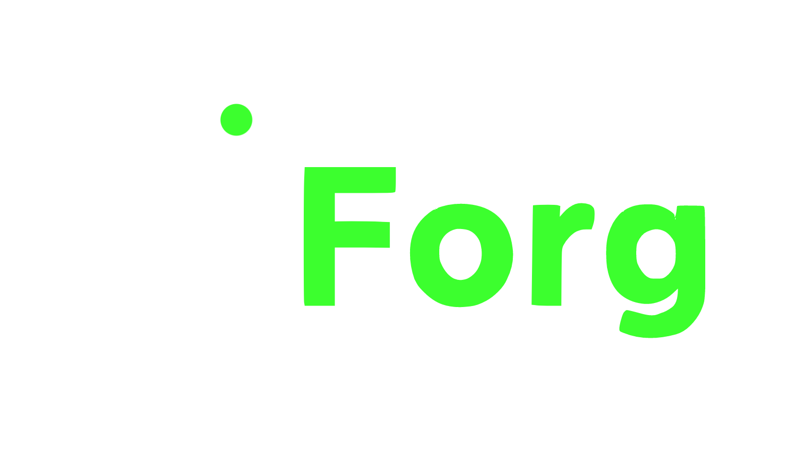
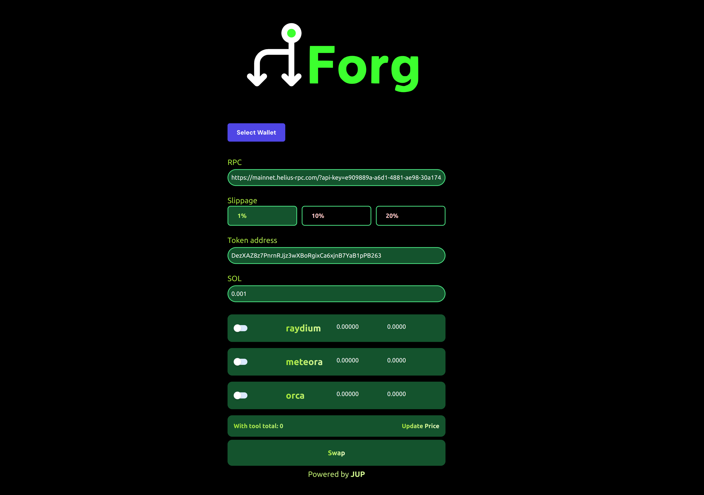

## Overview

This Vue.js component provides a user interface for trading tokens on the Solana blockchain using multiple liquidity pools simultaneously. It's designed to mitigate the impact of arbitrage bots by spreading trades across different exchanges.

## Features

- Connect to Solana wallet
- Select slippage tolerance
- Input token address and amount
- Choose from multiple exchanges (Raydium, Meteora, Orca)
- Real-time price updates
- Execute swaps across selected exchanges

## Prerequisites

- Node.js and npm installed
- Vue.js 3.x
- Solana wallet (e.g., Phantom, Solflare)

## Installation

1. Clone the repository:
   ```
   git clone [your-repo-url]
   cd [your-repo-name]
   ```

2. Install dependencies:
   ```
   npm install
   ```

3. Set up environment variables:
   Create a `.env` file in the root directory and add your Helius RPC URL:
   ```
   VUE_APP_RPC_URL=https://mainnet.helius-rpc.com/?api-key=your-api-key
   ```

## Usage

1. Import the component in your Vue.js application:
   ```vue
   import SolanaTrading from './components/SolanaTrading.vue'
   ```

2. Use the component in your template:
   ```vue
   <template>
     <SolanaTrading />
   </template>
   ```

3. Ensure you have set up Solana wallet integration in your main app file:
   ```javascript
   import { WalletAdapterNetwork } from '@solana/wallet-adapter-base'
   import { initWallet } from 'solana-wallets-vue'

   initWallet({
     wallets: [/* your wallet adapters */],
     autoConnect: true,
     network: WalletAdapterNetwork.Mainnet,
   })
   ```

## Component Structure

- `<script setup>`: Contains the component's logic, including:
  - Wallet connection handling
  - Exchange data management
  - Quote fetching and updating
  - Transaction creation and sending

- `<template>`: Provides the user interface, including:
  - Wallet connection button
  - RPC URL input
  - Slippage selection
  - Token address and amount inputs
  - Exchange selection and display
  - Swap button

## Key Functions

- `updateExchangeAmounts()`: Calculates and updates the amount for each selected exchange
- `fetchQuote()`: Retrieves quotes from the Jupiter API for a given exchange
- `updateQuotes()`: Updates quotes for all selected exchanges
- `swapTransaction()`: Creates and sends the swap transaction

## Customization

You can customize the component by modifying the following:

- `RPC_URL`: Default RPC URL for Solana connection
- `MINT`: Default token address for swaps
- `exchanges`: Add or remove exchanges as needed
- Styling: Adjust the Tailwind CSS classes in the template for visual customization

## Dependencies

- `@solana/web3.js`: Solana Web3 library
- `solana-wallets-vue`: Vue 3 Solana wallet adapter
- `cross-fetch`: Universal WHATWG Fetch API for Node and browser
- `bs58`: Base 58 encoding/decoding

## Note

This component uses the Jupiter API for quoting and swap instructions. Ensure you comply with Jupiter's terms of service and API usage guidelines.

## Contributing

Contributions are welcome! Please feel free to submit a Pull Request.


